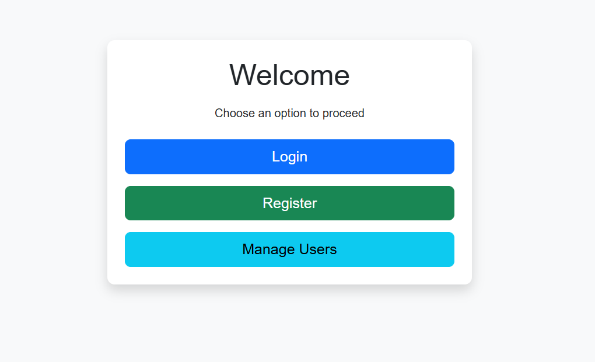

# 🛡️LogiRegServerCRUD 🔒


LogiRegServerCRUD is a full‑stack mini project demonstrating a complete user authentication and management system integrated with a mock JSON server database. It features user login, registration, and a dashboard for managing users with full CRUD operations (GET, POST, PUT, DELETE).

---

## 🔑 Key Features

- **User Authentication & Management**
  - Login & Registration forms with robust validations using **Regex**
  - Dashboard to manage users (view, update, delete)

- **CRUD Operations**
  - **GET**, **POST**, **PUT**, and **DELETE** requests using **Axios**
  - Operations performed on a mock JSON Server

- **Modern JavaScript (ES6+)**
  - Usage of async/await for asynchronous operations
  - Clean and modular code using callbacks, arrow functions, and template literals

- **Responsive UI**
  - Built with HTML5, CSS3, and Bootstrap for a professional look and feel
  - Intuitive user interface with interactive elements

---

## 🛠️ Tech Stack

- **Frontend:** HTML, CSS, Bootstrap, JavaScript (ES6+)
- **API/HTTP Library:** Axios
- **Backend (Mock):** JSON Server

---

## 🚀 Installation & Setup

1. **Clone the Repository:**

   ```bash
   git clone https://github.com/yourusername/LogiRegServerCRUD.git
   cd LogiRegServerCRUD

2. **Install JSON Server Globally (if not already installed):**
   ```
   npm install -g json-server
   ```
3. **Start the JSON Server**
   - Navigate to the folder containing the server.json file (inside the Server folder, if applicable):
     ```
     json-server --watch server.json --port 3000
     ```
4. **Launch the Application**
   - Open the project using a local server (e.g., Live Server in VS Code) or serve the files using your preferred method. run index.html after start the JSON server

## 🔄 How It Works
**Registration**
 - The registration form validates inputs using regex and sends a POST request to the JSON server. On successful registration, the user is redirected to the Login page.

**Login**
 - The login form validates credentials and uses a GET request to verify user details. If credentials match, the user is redirected to the Dashboard.

**Dashboard / Manage Users**
 - The dashboard displays registered users in a table. It supports:
    - Update: Opens a modal for editing user details and sends a PUT request.
    - Delete: Sends a DELETE request to remove a user.
  
**Asynchronous Operations**
 - The project utilizes modern ES6 features (async/await, arrow functions) to manage asynchronous API calls seamlessly.


🤝 Contributing
Contributions, issues, and feature requests are welcome! Please check the issues page if you'd like to contribute.
